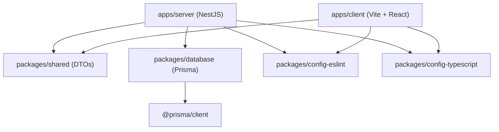

# Architecture & Package Boundary Specification

This document details the architectural decisions, package graph, and data flow patterns enforced in the **Project X** monorepo.

---

## 🏗 Dependency Graph & Topological Boundaries

---

## 📦 Package Contracts

1. **`@project/shared`**:
   - Single source of truth for cross-boundary data transfer objects (DTOs) and validation classes (`class-validator`).
   - Must export transpiled CJS/ESM modules via `dist/index.js` and `dist/index.d.ts`.
2. **`@project/database`**:
   - Encapsulates Prisma ORM models, migration history, and database client instantiation.
   - Must be generated via `pnpm db:generate` before compilation of dependent apps.
3. **`@project/eslint-config`**:
   - Modular ESLint Flat Config (`base.mjs`, `node.mjs`, `react.mjs`).
4. **`@project/typescript-config`**:
   - Centralized compiler configuration (`base.json`, `node.json`, `react.json`).

---

## ⚡ Turborepo Task Pipeline

Tasks are orchestrated via `turbo.json`:

- **`db:generate`**: Generates Prisma client types from `schema.prisma`.
- **`build`**: Depends on `^build` (topological parent build) and `db:generate`.
- **`test`**: Depends on `build` outputs.
- **`lint` & `typecheck`**: Independent parallel verification tasks.
